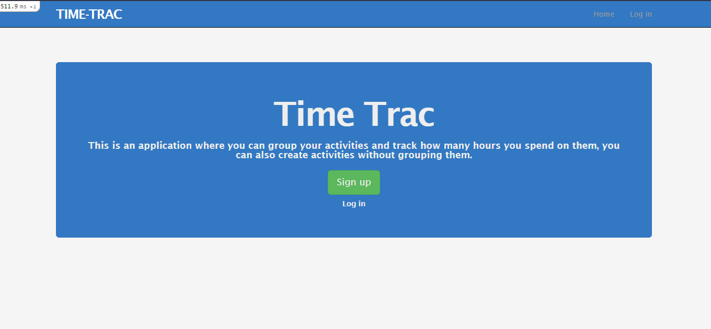
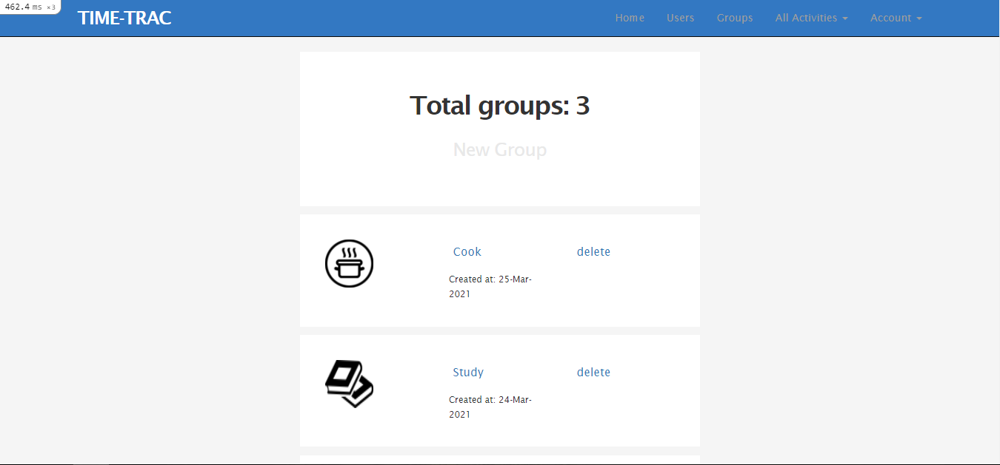
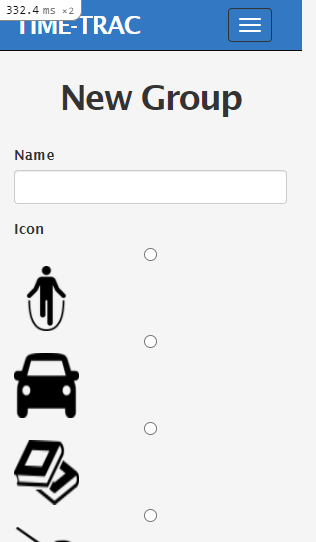
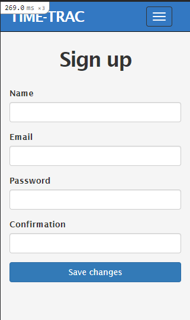

# Time Trac app with Ruby on Rails

This is an application where you can group your activities and track how many hours you spend on them, you can also create activities without grouping them.

## Desktop Screenshot




## Small screen Screenshot




## Built With

- Ruby 
- Ruby on Rails 

## Live Demo

[Live Demo](https://gentle-ocean-23050.herokuapp.com/)

## Demostration

[Video](https://www.loom.com/share/efc112c8dfd34cd8845419e3a5b99e58)

## Getting Started

To get a local copy up and running follow these simple example steps.

### Prerequisites

Ruby: 2.6.6
Rails: 6.1.3
Development sqlite3: '~> 1.4'
Production Postgres

### Setup

Clone the repository

```
git clone https://github.com/Rocio01/capstone-rails.git
```

Instal gems with:

```
bundle install
```

Setup database with:

```
   rails db:create
   rails db:migrate
```

### Github Actions

To make sure the linters' checks using Github Actions work properly, you should follow the next steps:

1. On your recently forked repo, enable the GitHub Actions in the Actions tab.
2. Create the `feature/branch` and push.
3. Start working on your milestone as usual.
4. Open a PR from the `feature/branch` when your work is done.


### Usage

Start server with:

```
    rails server
```

Open `http://localhost:3000/` in your browser.

### Run tests

```
    rpsec --format documentation
```
```
     bundle exec rspec
```
   
Unit and Integration Test has been implemented using RSpec and Capybara.


## Author


👤 **Rocio Martinez**

- Github: [@Rocio01](https://github.com/Rocio01)
- Twitter: [@rugiada8801](https://twitter.com/rugiada8801)
- Linkedin: [zulma-rocio-martinez](https://www.linkedin.com/in/zulma-rocio-martinez)

## 🤝 Contributing

Contributions, issues and feature requests are welcome!

Feel free to check the [issues page](issues/).

## Show your support

Give a ⭐️ if you like this project!

## Acknowledgments

- Microverse
- GitHub
- [ Gregoire Vella](https://www.behance.net/gregoirevella) for the design guide.


## 📝 License

-This project is MIT licensed.